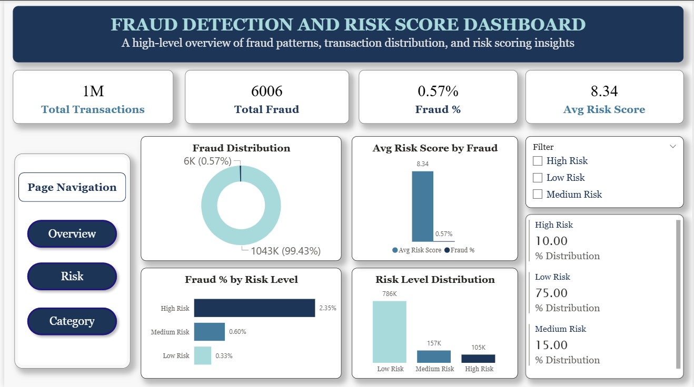
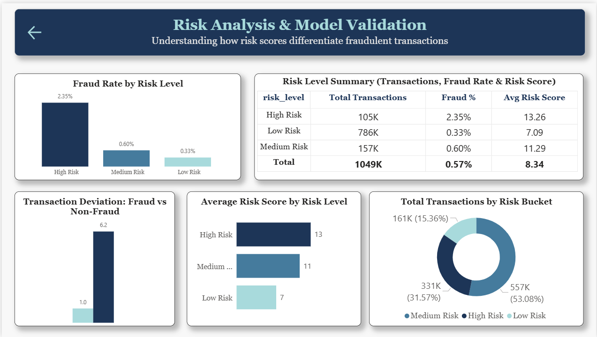
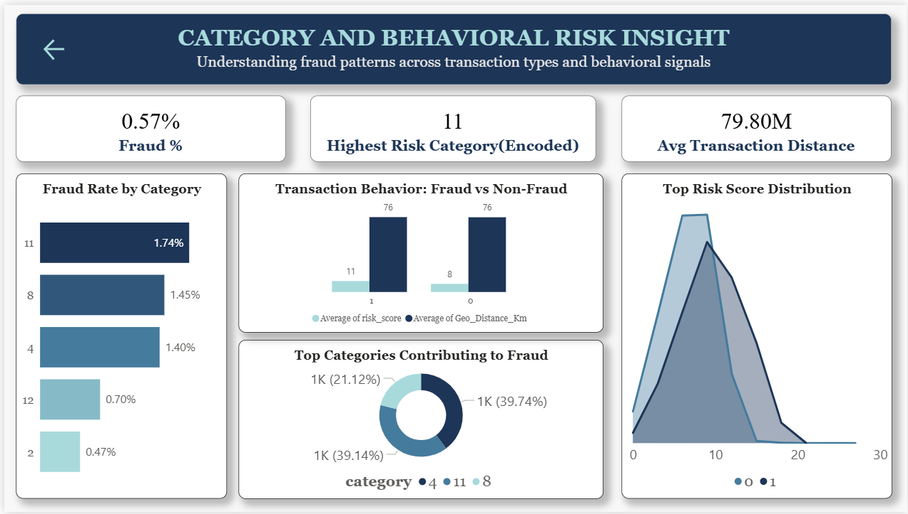

# Fraud Detection Analysis & Risk Scoring Model

## Project Overview

This project presents an end-to-end fraud detection analysis using transactional data. It focuses on identifying fraudulent patterns through exploratory data analysis, feature engineering, and a custom-built risk scoring model.

The goal is to simulate a real-world fraud detection system by combining behavioral signals such as transaction amount deviation, geographic distance, and category-level risk.

---

## Objectives

* Analyze transaction patterns to identify fraud indicators
* Build a risk scoring model to flag high-risk transactions
* Validate the effectiveness of engineered features
* Develop an interactive dashboard for business insights

---

## Tech Stack

* **Python** – Data analysis & feature engineering (Pandas, NumPy)
* **SQL (MySQL)** – Data querying & aggregation
* **Power BI** – Interactive dashboard & visualization

---

## Dataset

* Preprocessed and encoded transactional dataset
* Contains:

  * Transaction amount (`amt`)
  * Category (encoded)
  * Geographic features (`geo_distance_km`)
  * Engineered features:

    * Amount deviation
    * Category risk
    * High distance flag
    * Risk score

*Note:* Categorical variables are encoded for modeling purposes, which limits direct interpretability in certain visualizations (e.g., geographic mapping).

---

## Methodology

### 1. Feature Engineering

Key features created to capture fraud behavior:

* **Amount Deviation** – Difference from category average
* **Geographic Distance** – Distance between user and merchant
* **Category Risk** – Historical fraud probability per category
* **High Distance Flag** – Binary anomaly indicator

---

### 2. Risk Scoring Model

A composite risk score was developed using weighted features:

* Amount deviation (behavior anomaly)
* Category risk (historical pattern)
* Distance factor (geographical anomaly)

This scoring mechanism enables prioritization of high-risk transactions.

---

### 3. SQL Analysis

Performed structured queries to:

* Calculate fraud rates
* Segment transactions by risk levels
* Identify high-risk categories
* Aggregate behavioral metrics

---

### 4. Dashboard Development

Designed a 3-page Power BI dashboard:

#### Page 1: Overview

* Key KPIs (Total Transactions, Fraud %, Risk Score)
* Fraud distribution
* Risk level segmentation

#### Page 2: Model Validation

* Risk score effectiveness
* Feature impact on fraud detection
* Behavioral comparison (fraud vs non-fraud)

#### Page 3: Category & Behavioral Insights

* Fraud concentration across categories
* Transaction behavior patterns
* Risk score distribution analysis

---

## Key Insights

* Fraud rate is extremely low (~0.57%), indicating a highly imbalanced dataset
* High-risk transactions show significantly higher fraud probability (~2.3%)
* Transaction distance and amount deviation are strong fraud indicators
* Certain categories contribute disproportionately to fraud

---

## Dashboard Preview

### Overview

### Model Validation

### Insights

---

## Conclusion

This project demonstrates how combining behavioral analytics with a structured risk scoring approach can effectively identify fraudulent transactions. It highlights the importance of feature engineering and data-driven decision-making in fraud detection systems.

---

## Future Improvements

* Integrate machine learning models
* Decode categorical variables for enhanced interpretability
* Deploy as a real-time fraud monitoring system
* Add anomaly detection techniques

---
